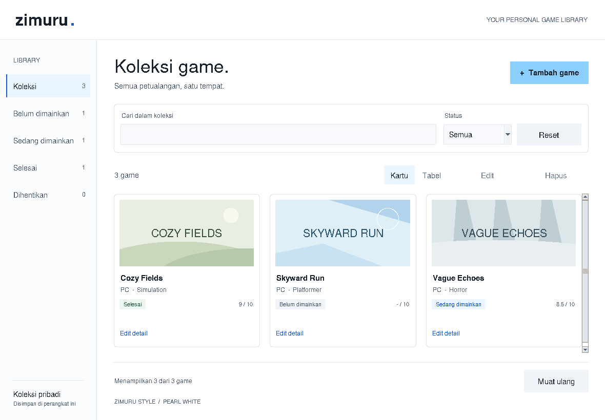

# Game Library Manager

[](https://github.com/ZidaneNaufal1/game-library-manager/actions/workflows/tests.yml)

A desktop application for organizing a personal game collection
and tracking games from backlog to completion.

Built with **Python, Tkinter, and SQLite**, with a
**Zimuru Style v1.1 — Pearl White** interface.

## Preview



The screenshot shows an example collection.
Game data is stored locally and is not bundled with the repository.

## Features

- **Add games** with a title, platform, genre, status, and optional rating.
- **Browse your collection** in a responsive card grid or a detailed table.
- **View original pastel cover placeholders** generated locally from the title and genre.
- **Edit games** using the Edit button or by double-clicking a row.
- **Delete games** with confirmation.
- **Search titles live** without case sensitivity, or press Enter to search immediately.
- **Filter by status** using the sidebar or dropdown.
- **Combine search and filtering** to narrow the results.
- **Reset filters** to display the entire collection.
- **Store data locally** in SQLite between application sessions.
- **Validate inputs**, including required fields and ratings from 0 to 10.
- **View collection counts** and messages when no results are found.

Click a card or table row to select a game.
Edit and Delete buttons become available when a game is selected.
Each card also provides an **Edit detail** action.
The selected game stays selected when switching between **Kartu** and **Tabel**.

## Design — Zimuru Style

The interface follows **Zimuru Style v1.1 — Pearl White**, a design identity
by Muhammad Zidane Naufal Azzam.

Its visual direction combines pearl white surfaces, ice blue accents,
charcoal typography, clear spacing, and restrained layering.
The default view is a card collection with a light sidebar and rounded toolbar.
Cards reflow as the window changes size; the collection scrolls vertically.

| Element | Color |
|---|---|
| Soft background | `#F7F9FC` |
| Main surface | `#FFFFFF` |
| Secondary surface | `#F0F4F8` |
| Primary text | `#17212B` |
| Secondary text | `#526174` |
| Ice blue accent | `#8CCFFF` |

The active sidebar item uses a thin blue indicator on an ice blue tint.
Status labels remain visible alongside their color cues.

This Tkinter implementation uses opaque white surfaces, subtle borders,
and custom rounded panels as a portable fallback for glass effects.
It does not implement background blur or transparent liquid glass.
Pastel illustrations are original placeholders, not downloaded game covers.
Existing SQLite data and the database schema are unchanged.

## Technology

| Technology | Purpose |
|---|---|
| Python | Application logic |
| Tkinter and ttk | Desktop interface |
| SQLite | Local data storage |
| pathlib | Database path handling |
| Git | Version control |

No third-party Python packages are required.

## Requirements

- Python **3.8 or newer**
- Tkinter
- A desktop environment with GUI support

SQLite is included with standard Python installations.

For WSL, GUI application support must be available.
A terminal-only environment cannot display the application window.

## Getting Started

Download the repository or clone it:

```bash
git clone https://github.com/ZidaneNaufal1/game-library-manager.git
cd game-library-manager
```

### Ubuntu / WSL

Install Tkinter if it is missing:

```bash
sudo apt update
sudo apt install python3-tk
```

Check that a Tkinter window can open:

```bash
python3 -m tkinter
```

Run the application:

```bash
python3 main.py
```

### Windows

With Python and Tkinter installed, run from the project folder:

```powershell
py main.py
```

The application creates its database automatically on first launch.

## Usage

### Add a Game

1. Click **Tambah Game**.
2. Enter the title, platform, and genre.
3. Choose a status.
4. Optionally enter a rating from 0 to 10.
5. Click **Simpan Game**.

Platform and genre can be selected from the available suggestions
or entered manually.

Ratings accept a decimal point or decimal comma, such as `8.5` or `8,5`.
An empty rating is displayed as `-`.

### Choose a View

- Click **Kartu** for pastel cards with genre, platform, status, and rating.
- Click **Tabel** for a compact view of the same game details.
- Click a card to select it, then use **Edit** or **Hapus**.
- The sidebar counts represent the complete collection, independent of search.

### Edit a Game

1. Select a card or table row.
2. Click **Edit**, click **Edit detail** on a card, or double-click a table row.
3. Update the details.
4. Click **Simpan Game**.

Click **Batal** or press Escape to close the form without saving.

After adding or editing a game, filters reset and the saved game is selected.
The card and table views show the same underlying collection.

### Delete a Game

1. Select a card or table row.
2. Click **Hapus**.
3. Confirm the deletion.

Canceling the confirmation keeps the game.
Confirmed deletion cannot be undone from the application.

### Search and Filter

- Enter part of a title. Results update after a short pause, or immediately when you press Enter.
- Choose a status from the sidebar or dropdown.
- Search and status filters work together.
- Click **Reset** to clear the search and show all statuses.
- Click **Muat ulang** to reload the collection using the current filters.

Filtering only changes the displayed results; it does not delete data.

## Game Statuses

| Status | Meaning |
|---|---|
| Backlog | Not started yet |
| Playing | Currently playing |
| Completed | Finished |
| Dropped | Stopped playing |

## Project Files

| File | Purpose |
|---|---|
| `main.py` | Zimuru Style GUI, forms, navigation, search, and filters |
| `pearl_ui.py` | Pearl White tokens, rounded surfaces, status labels, and cover placeholders |
| `database.py` | SQLite operations and shared input validation |
| `.gitignore` | Excludes local data, caches, and environment folders |
| `screenshots/pearl-white.png` | Current application preview |
| `screenshots/dashboard.png` | Previous dark-theme preview |
| `tests/test_pearl_ui.py` | Display-backed UI integration checks |
| `README.md` | Setup, usage, and project documentation |
| `data/games.db` | Local database created automatically; excluded from Git |

## Data Storage

The collection is stored in `data/games.db`, relative to the project folder.

Each downloaded or cloned copy starts with an empty collection.
No account, network connection, or external database server is required
to use the application.

The `data/` folder is excluded from version control.
Deleting `games.db` removes the collection stored in that file.

## Automated GUI Checks

Run with a desktop display available:

```bash
python3 -m unittest discover -s tests -v
```

For headless Linux, install Xvfb and run:

```bash
xvfb-run -a python3 -m unittest discover -s tests -v
```

The tests use a temporary database. They cover CRUD forms and validation,
selection between views, search plus filtering, empty states, and resizing.
They skip when no supported display is configured.

## Manual Verification Checklist

Use these checks when validating changes:

- [ ] Add a game and verify that it appears in the table.
- [ ] Restart the application and verify that the game remains.
- [ ] Edit a game and verify that changes persist after restarting.
- [ ] Cancel an edit and verify that the original data remains.
- [ ] Cancel deletion and verify that the game remains.
- [ ] Confirm deletion and verify that it remains deleted after restarting.
- [ ] Check that Edit and Delete are disabled without a selected row.
- [ ] Try an empty title, platform, or genre.
- [ ] Try a nonnumeric rating and ratings outside 0–10.
- [ ] Save a game without a rating.
- [ ] Search using different letter cases.
- [ ] Filter through both the sidebar and dropdown.
- [ ] Combine title search with a status filter.
- [ ] Verify the message when no results match.
- [ ] Reset filters and verify that the collection returns.
- [ ] Resize the window and check control visibility.
- [ ] Use Tab to navigate controls and check visible focus.

## Current Limitations

- Local storage only; no cloud synchronization.
- No automatic imports from Steam or other game platforms.
- No imported cover artwork support; cards use abstract placeholders.
- No packaged executable yet.
- Search loads the collection and filters it in Python.
- System message dialogs may look different across operating systems.
- Glass blur and rounded native ttk controls are not implemented; panels are rounded.
- Long titles and metadata may be shortened on cards; the table and edit form retain the full data.

## Learning Goals

This project practices:

- Desktop GUI development with Tkinter and ttk.
- SQLite Create, Read, Update, and Delete operations.
- Shared input validation.
- Parameterized SQL queries.
- Organizing interface behavior in a Python class.
- Separating database logic from interface code.
- Applying reusable design tokens.
- Git commits and project documentation.

## Author

**Muhammad Zidane Naufal Azzam**

GitHub: [ZidaneNaufal1](https://github.com/ZidaneNaufal1)
